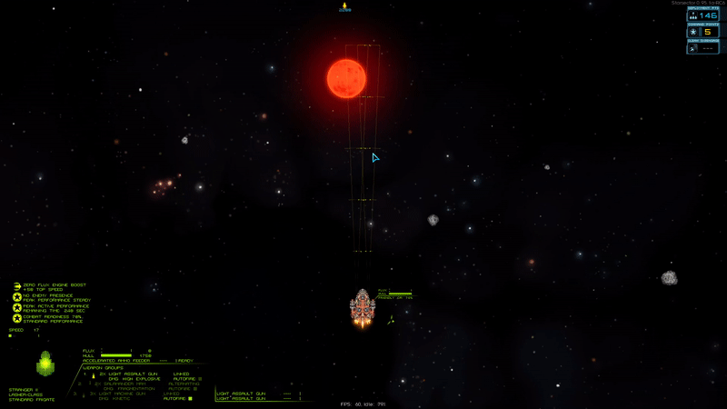

# Combat GUI example

A simple example showcasing how to use the combat GUI lib.

The relevant files are everything in src and data/config/settings.json.

To see what the example GUI does, load this mod, enter combat and press the '+'-Key.

## Step-by-step guide

1. Include AGC as a dependency in your mod_info.json
   1. Load AdvancedGunneryControl.jar as a library. If you are using Wisp's template (which I highly recommend), this will happen automatically.
   2. If you don't want your mod to have AGC as a dependency, I am also fine with you copy-pasting the combat gui lib into your mod, but please change the package name in that case (to avoid version conflicts).
      1. Don't forget to comply with the license in that case. As it's MIT-licensed, that should be easy enough, you just have to include the license notice in your mod.
2. Create a new class that extends com.dp.advancedgunnerycontrol.combatgui.GuiBase
   1. Override the method getTitleString with a title to display when the GUI is opened
   2. (optional) Override getMessageString if you want to display general messages. Feel free to put logic in here that changes the message based on context
   3. In the constructor, call super and pass it a new GuiLayout to define fonts, colors and positions
   4. Afterwards, call the addButton and addButtonGroup methods in the constructor to create actual buttons
      1. you will need to define actions by implementing the ButtonAction and ButtonGroupAction interfaces
      2. For button groups, you will also need a CreateButtonsAction (or use the CreateSimpleButtons class)
      3. You can also define a RefreshAction, or simply pass null
3. Create a GUI-Launcher class that creates a new GUI object when a certain condition is met and deletes it again afterwards
   1. If you simply want to open/close the GUI when a hotkey is pressed, you can extend the SampleGuiLauncher class
   2. If your mod already has a EveryFramePlugin, feel free to implement the logic there instead
4. Register the GUI-launcher as a plugin to load in data/config/settings.json (or mod_info.json)
5. (Optional) Have a look at the source code of the library if something is unclear: <https://github.com/DesperatePeter/starsector-advanced-weapon-control/tree/master/src/main/kotlin/com/dp/advancedgunnerycontrol/combatgui>